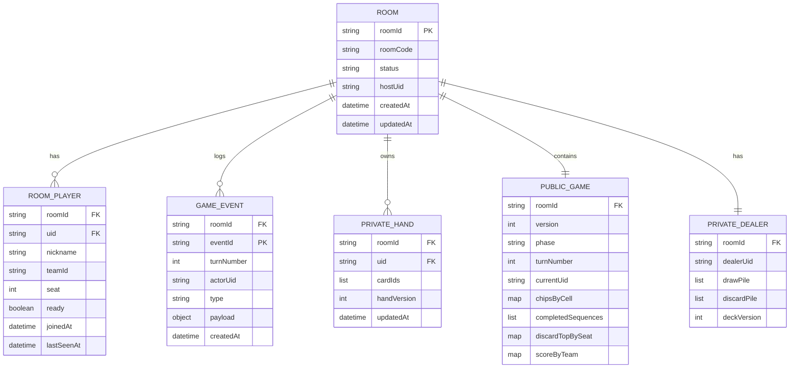

# 05. 데이터 모델 & ERD(개념/Firestore 스키마)

## 1) 설계 목표
- **무료 구간 최적화**: 구독 문서 수를 최소화(권장: public 1 + private 1).
- **비공개 정보 분리**: 손패/덱은 public에 두지 않는다.
- **부분 업데이트 최적화**: 보드 상태는 “전체 배열” 대신 “점유 맵”으로 저장해 단일 필드 업데이트를 가능하게 한다.

---

## 2) 개념 ERD(도메인 관점)



---

## 3) Firestore 컬렉션 구조(권장)
### 3.0 `roomCodes/{code}` (public lookup)
```ts
type RoomCodeDoc = {
  roomId: string;              // rooms/{roomId} 참조
  createdAt: Timestamp;
};
```
- 참가자는 먼저 `roomCodes/{code}`를 읽어 roomId를 얻고, 그 다음 `players/{uid}`를 생성해 참가자가 된다.
- roomId를 직접 노출하지 않고도 “코드 기반 입장”을 구현할 수 있다.


### 3.1 `rooms/{roomId}` (public, 핵심)
```ts
type RoomDoc = {
  roomCode: string;            // 6자리 코드
  status: "lobby" | "playing" | "ended";
  hostUid: string;

  createdAt: Timestamp;
  updatedAt: Timestamp;

  config: {
    mode: "teams2";            // MVP: teams2 고정
    maxPlayers: 4;             // MVP: 4 고정(2v2) 또는 2
    maxSpectators: 2;          // 관전 최대 2명
    sequenceToWin: 2;          // 2팀 모드 기본
    oneEyedJackCanBreakSequence: boolean; // MVP: false
    turnTimeSec?: number;      // 선택
  };

  // 게임 공개 상태 (모든 참가자가 구독)
  game?: {
    version: number;           // public state version
    phase: "setup" | "playing" | "ended";
    turnNumber: number;
    currentUid: string;        // 현재 턴
    currentSeat: number;

    // 보드 점유: cellId(0..99) -> teamId("A"|"B")
    // 변형 규칙: 코너(0,9,90,99)도 점유 저장, 와일드/공유 아님
    chipsByCell: Record<string, "A" | "B">;

    // 완성된 시퀀스: 제거 불가 판단 및 점수 계산용
    completedSequences: Array<{
      teamId: "A" | "B";
      cells: number[];         // 길이 5
      createdTurn: number;
    }>;

    // 공개 discard: seat -> 최근 버린 카드(혹은 N장 요약)
    discardTopBySeat: Record<string, string | null>; // cardId
    scoreByTeam: Record<"A" | "B", number>;          // 완료 시퀀스 수

    // 덱 메타(공개): 카드 개수만 공개
    deckMeta: { drawLeft: number; reshuffles: number; };

    winner?: { teamId: "A" | "B"; atTurn: number; };  // 변형: 덱 소진 시 무승부면 winner 없이 ended
    lastAction?: { uid: string; type: string; at: Timestamp; };
  };
};
```

> **보드 레이아웃(카드 배치)**은 DB에 저장하지 않고, **상수 JSON 파일**로 둔다. 클라이언트 코드에서 정의하지 않으며, JSON 내용은 01-game-rules의 boardImages와 동일하다(18 문서 참조).  
> Firestore에는 “칩 점유”만 저장한다(용량/업데이트 효율).

### 3.2 `rooms/{roomId}/players/{uid}` (public)
- 동일 컬렉션에 **참여자(participant)** 와 **관전자(spectator)** 모두 등록. `role`로 구분.
- 참여자만 `teamId`/`seat`/`ready` 사용. 관전자는 해당 필드 없음 또는 null.

```ts
type RoomPlayerDoc = {
  uid: string;
  nickname: string;
  role: "participant" | "spectator";  // 참여자(게임 플레이) vs 관전자(최대 2명)
  teamId?: "A" | "B";                 // participant만. 팀 색상: A=레드(1번), B=블루(2번), 확장 시 C=그린(3번). 09 문서 참조.
  seat?: number;                      // 0..3, participant만
  ready?: boolean;                    // participant만

  joinedAt: Timestamp;
  lastSeenAt: Timestamp;              // presence(저빈도 업데이트 권장)
};
```
- 관전자 수는 `role === "spectator"`인 문서 수로 계산; **최대 2명** 제한(FR-4.1).
- 게임 시작 후(`status === "playing"`)에는 관전 신규 입장 불가.

### 3.3 `rooms/{roomId}/privateHands/{uid}` (private: uid만 read)
```ts
type PrivateHandDoc = {
  uid: string;
  cardIds: string[];            // 손패
  handVersion: number;          // private version
  updatedAt: Timestamp;
};
```

### 3.4 `rooms/{roomId}/privateDealer/deck` (private: host만 read/write)
```ts
type PrivateDealerDoc = {
  dealerUid: string;            // hostUid 동일
  drawPile: string[];           // top = last element(권장)
  discardPile: string[];        // 전체 discard(검증/리플레이용)
  deckVersion: number;
};
```

### 3.5 `rooms/{roomId}/events/{eventId}` (선택)
- 턴 로그/디버깅/리플레이 목적
- MVP에서는 비활성화 가능(비용 최적화)

---

## 4) cellId 정의(중요)
- **0..99** = **row×10 + col** (row-major). 보드의 **카드 배치(어떤 cellId에 어떤 카드)** 는 **01-game-rules.md의 boardImages**로 고정되며, [18. 보드 레이아웃](18-board-layout.md)에서 정리한다.
- 코너 cellId: **0, 9, 90, 99**
  - 변형 규칙: 코너도 카드로 칩을 놓으므로 `chipsByCell`에 점유 저장, 팀 전용(공유 불가)

---

## 5) 카드 ID 규격
- **형식**: 카드 한 장을 유일하게 식별하는 문자열. **이미지 파일명(확장자 제외)과 동일**하게 두는 것을 권장한다.
  - 예: `spade_2_1`, `heart_a_2`, `heart_10_1`, `diamond_q_2`, `o_o_1`(코너 1) … `o_o_4`(코너 4)
  - 패턴: `{suit}_{rank}_{variant}` (suit: spade|heart|diamond|clover|o, rank: 2..10|j|q|k|a, variant: 1|2. 코너는 o_o_1..4)
- **잭**: `clover_j_1`/`clover_j_2`, `diamond_j_1`/`diamond_j_2`, `heart_j_1`/`heart_j_2`, `spade_j_1`/`spade_j_2` 등. **j_2** = Two-eyed Jack, **j_1** = One-eyed Jack(01 문서 참조).

### 5.1 카드 이미지 경로
- 카드 이미지는 **webp** 포맷을 사용하며, 경로는 다음 규칙으로 고정한다.
  ```
  /cards/webp/{cardId}.webp
  ```
  - 예: `spade_2_1` → `/cards/webp/spade_2_1.webp`
  - 예: `heart_j_1` → `/cards/webp/heart_j_1.webp`
  - 예: `o_o_3`(코너) → `/cards/webp/o_o_3.webp`
- 실제 파일 위치: `public/cards/webp/{cardId}.webp` (108장: 일반 104장 + 코너 4장)
- **유틸리티**: `src/shared/lib/cardImage.ts`
  - `cardImageUrl(cardId)` → URL 문자열 반환
  - `cardAltText(cardId)` → 한국어 접근성 alt 텍스트
- **사용 위치**
  - 손패(hand): `src/app/game/[roomId]/page.tsx` — `CardTile` 컴포넌트
  - 보드 셀(board cell): M4 구현 시 동일 유틸리티 사용

---

## 6) DoD 체크리스트
- [ ] public room doc 1개 구독으로 보드/턴/점수가 동기화된다
- [ ] privateHands는 uid 외 read 불가다
- [ ] 보드 점유는 `chipsByCell` 맵으로 부분 업데이트가 가능하다
