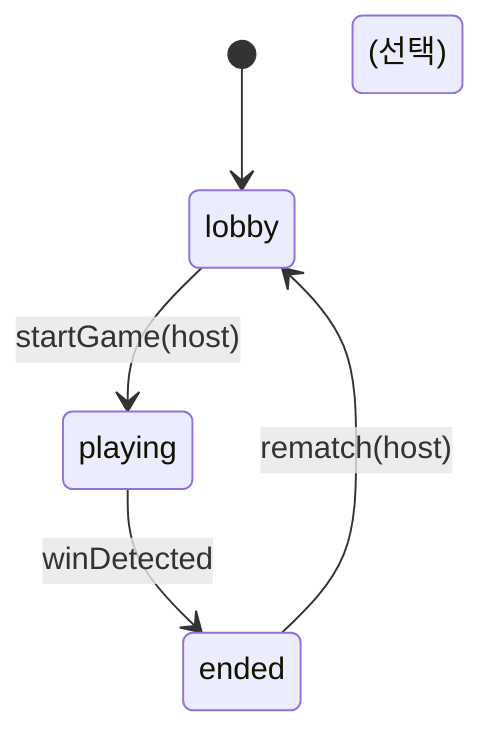

# 08. 상태/액션 계약(프로토콜)

## 1) 목표
- 클라이언트/스토어/UI가 공통으로 참조할 **단일한 상태 모델**과 **액션 타입**을 정의한다.
- Firestore 업데이트는 가능한 한 **턴 단위 트랜잭션 1회**로 수렴한다.

---

## 2) 상태 머신(Phase)



---

## 3) 카드/잭 판정 규칙(상수)
- Two-eyed Jack(와일드 배치): 카드 ID가 `*_j_2` 형태(예: `clover_j_2`, `heart_j_2`)
- One-eyed Jack(상대 제거): 카드 ID가 `*_j_1` 형태(예: `clover_j_1`, `heart_j_1`)

> 카드 ID 규격: `{suit}_{rank}_{variant}`. 잭 종류는 **variant 번호(j_1/j_2)**로 판별한다.

---

## 4) 액션 타입(도메인)

### 4.1 로비 액션
```ts
type LobbyAction =
  | { type: "ROOM_CREATE"; nickname: string }
  | { type: "ROOM_JOIN"; roomCode: string; nickname: string }
  | { type: "ROOM_JOIN_AS_SPECTATOR"; roomCode: string; nickname: string }  // 참가 자리 없을 때 자동 사용
  | { type: "ROOM_LEAVE" }                    // 관전자는 항상 가능; 참여자는 버튼 없음(연결 끊김 시만 퇴장)
  | { type: "PLAYER_READY_SET"; ready: boolean }
  | { type: "PLAYER_TEAM_SET"; teamId: "A" | "B" }
  | { type: "PLAYER_SWITCH_TO_SPECTATOR" }   // 로비에서만, 참여자 → 관전
  | { type: "SPECTATOR_SWITCH_TO_PARTICIPANT" }  // 로비에서만, 관전자 → 참여(자리 있을 때)
  | { type: "HOST_START_GAME" };
```
- **게임 시작 후**: 관전자만 `ROOM_LEAVE` 가능(퇴장 버튼). 참여자는 퇴장 버튼 미제공.

### 4.2 게임 액션(턴)
```ts
type GameAction =
  | {
      type: "TURN_PLAY_NORMAL";
      expectedVersion: number;
      cardId: string;          // e.g. "heart_10_1" (05 문서 카드 ID 규격)
      targetCellId: number;    // 보드에서 해당 카드 칸(2개 중 1개)
    }
  | {
      type: "TURN_PLAY_JACK_WILD";
      expectedVersion: number;
      cardId: string;          // *_j_2 형태 (Two-eyed)
      targetCellId: number;    // 어떤 빈칸
    }
  | {
      type: "TURN_PLAY_JACK_REMOVE";
      expectedVersion: number;
      cardId: string;          // *_j_1 형태 (One-eyed)
      removeCellId: number;    // 상대 칩 제거 대상
    }
  // 변형 규칙: 데드 카드는 교체하지 않고 손에 유지(사용 불가). TURN_EXCHANGE_DEAD_CARD 미지원.
  // | { type: "TURN_EXCHANGE_DEAD_CARD"; expectedVersion: number; deadCardId: string; };
```

### 4.3 이벤트 로그(선택)
```ts
type GameEvent =
  | { type: "EVT_TURN"; turnNumber: number; actorUid: string; action: GameAction; at: number }
  | { type: "EVT_SEQUENCE"; turnNumber: number; teamId: "A"|"B"; cells: number[]; at: number };
```

---

## 5) 트랜잭션 단위(권장 구현)

### 5.1 public 업데이트(rooms/{roomId})
- 공통 필드:
  - `game.version += 1`
  - `game.turnNumber += 1` (턴이 실제 진행된 경우)
  - `game.currentUid`/`game.currentSeat` → 다음 플레이어
  - `game.discardTopBySeat[seat] = cardId`
  - `game.lastAction = { uid, type, at }`

#### (1) 일반 카드
- `chipsByCell[targetCellId] = teamId`

#### (2) 2-eye 잭
- `chipsByCell[targetCellId] = teamId` (변형 규칙: 코너 포함 모든 빈 칸 가능, 단 바로 이전 턴에서 1-eye로 제거된 칸은 다음 순서 플레이어만 배치 불가)

#### (3) 1-eye 잭
- `delete chipsByCell[removeCellId]`
- 단, removeCellId가 `completedSequences`에 포함되면 금지(MVP)

### 5.2 private 업데이트(privateHands/{uid})
- hand에서 사용 카드 제거
- 드로우 1장 추가(또는 dead 교체)
- `handVersion += 1`

> MVP에서는 “public 트랜잭션 성공 후 private write”로 구현해도 된다.  
> 단, 네트워크 에러로 private update가 실패할 수 있으므로, 재시도/복구 로직이 필요하다.

---

## 6) 검증 로직(클라이언트)
Firestore Rules는 완전 검증이 어렵기 때문에, 클라이언트에서 1차 검증을 수행한다.

### 공통 검증
- 내 uid == room.game.currentUid
- expectedVersion == room.game.version
- phase == playing

### 일반 카드 검증
- `targetCellId`의 카드가 `cardId`와 매칭
- 해당 칸이 비어 있음
- `cardId`가 내 hand에 존재

### 잭 검증
- 2-eye: targetCellId가 비어 있음
- 1-eye: removeCellId에 상대 칩이 존재 + completedSequences에 포함되지 않음

### 데드 카드 검증(변형 규칙)
- cardId에 대응하는 두 칸이 모두 점유 시 데드 카드로 판정
- 데드 카드는 교체 불가, 손에 유지하며 사용 불가로만 처리(해당 카드로는 액션 불가)

---

## 7) 시퀀스 판정 알고리즘(권장)

### 입력
- `chipsByCell: Map<cellId, teamId>`
- 변형 규칙: 코너도 `chipsByCell`에 점유 저장(와일드/공유 아님)
- `completedSequences: Sequence[]`

### 출력
- 새로 추가할 `completedSequences`(0..N개)
- `scoreByTeam` 업데이트

### 절차(단순/안정)
1. “현재 팀” 기준으로 보드 점유 그리드(10x10)를 구성한다.
2. 4방향 벡터만 검사: 오른쪽(→), 아래(↓), 오른쪽아래(↘), 왼쪽아래(↙)
3. 각 cell을 시작점으로 길이 5의 라인을 검사:
   - 변형 규칙: 라인 내 같은 팀 칩 5칸 연속 시 candidate(코너도 일반 칸, 공유 없음)
4. candidate가 이미 `completedSequences`로 등록된 것과 **완전히 동일**하면 무시
5. 2시퀀스 모드에서 “중복 1칸 허용”:
   - 새로운 시퀀스의 cells 중 기존 시퀀스와 겹치는 cell 수가 1 이하이면 허용
   - 2개 이상 겹치면 거부(룰 해석을 문서로 고정)

> 중복 규칙은 구현 난이도가 높은 영역이므로, MVP에서는 “중복 1칸만 허용”으로 명시 고정한다.

---

## 8) DoD 체크리스트
- [ ] 액션 타입/페이로드가 문서와 코드에서 1:1로 일치한다
- [ ] expectedVersion 기반으로 중복 제출/충돌이 방지된다
- [ ] 시퀀스 판정이 매 턴 안정적으로 수행된다
